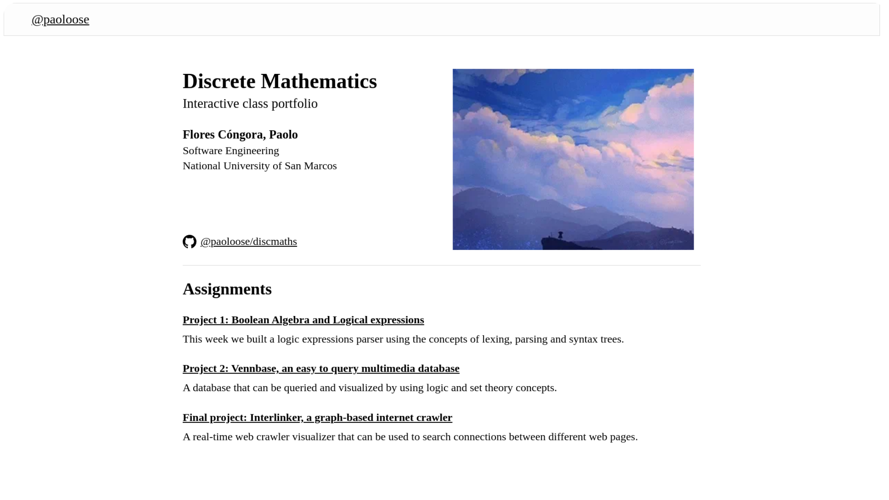

<h3 align="center">
    <br />
    paolo's interactive class portfolio<br />
</h3>

<p align="center">
<a target="_blank" href="https://paoloose.site/softarch"></a>
</a>
</p>

<!--  -->

All the course assignments are hosted here. Their logic/apis/packages reside in their
respective folders in `assignments/`, while all the web stuff is in `site/src/pages`.

The idea is that `assignments/` contains the solutions, while
`site/` provides a nice interface to interact with them.

```plain
├── assets
├── assignments
├── site
│
├── LICENSE
└── README.md
```

Running live at <https://paoloose.site/softarch>

**Project services are down?** At the time of writing this, I'm hosting the project's APIs
on a free DigitalOcean plan. If you find them down, I might have run out of credits.

There's a great chance they'll be back soon, for posterity's sake ;)
